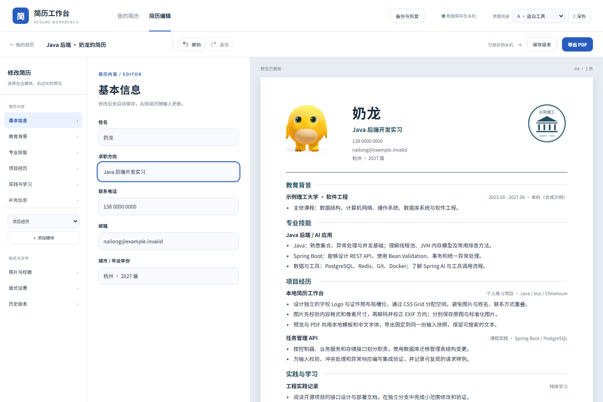

# Resume Workbench · 简历工作台

在自己的电脑上管理、编辑和导出中文简历。左侧选择模块，中间修改内容，右侧实时预览；可调整排版、保存历史版本，并导出可选择文字的中文 PDF。无需注册，默认不连接模型服务。

[下载发布版](https://github.com/MoChiUaena/resume-workbench/releases/latest) · [查看演示](docs/demo.gif) · [参与开发](CONTRIBUTING.md)



## 可以做什么

- **管理与编辑**：为不同岗位建立、复制和修改多份简历；支持教育、经历、项目、技能和自定义模块。
- **导入后核对**：从 DOCX 或含可选择文字的 PDF 提取内容，人工检查字段和模块后再创建新简历。当前源码版还可从 PDF 内嵌图片中手动选择证件照与学校 Logo。
- **调整版式**：四种 PDF 模板；可修改字体、颜色、字号、间距和图片裁剪，并切换两种界面风格与深色模式。
- **保存与导出**：自动保存、撤销与重做、历史版本对比和恢复；支持中文 PDF 与经预览确认的脱敏 PDF。
- **本地备份**：下载完整工作区 ZIP，也可启用每天或每周自动备份；备份包含简历、版本、图片和已保存的职位匹配报告。
- **可选 AI**：配置 DashScope、DeepSeek 或 GLM 后，可对选中句段提出润色建议，或分析职位匹配；发送内容和修改结果都由你核对。

当前最新发布版 `v0.9.0` 支持文字型 PDF 导入；PDF 内嵌图片选择已进入 `main` 源码，尚未包含在发布镜像中。扫描版 PDF 暂不支持 OCR。导入限制和核对方法见 [Word 导入](docs/docx-import.md)与 [PDF 导入](docs/pdf-import.md)。

## 快速开始：Docker 发布版

需要 Docker Desktop，或 Docker Engine 与 Compose。发布镜像目前提供 Linux amd64 架构。

1. 从[最新发布](https://github.com/MoChiUaena/resume-workbench/releases/latest)下载 `resume-workbench-config.zip`，解压后在该目录打开终端。
2. 将 `.env.example` 复制为 `.env`：PowerShell 运行 `Copy-Item .env.example .env`；Linux/macOS 运行 `cp .env.example .env`。
3. 编辑 `.env`，把 `RESUME_DB_PASSWORD` 换成自己的长随机密码。
4. 启动并等待服务就绪：

   ```sh
   docker compose up -d --wait
   ```

5. 打开 <http://127.0.0.1:18765>。端口冲突时，在 `.env` 中修改 `RESUME_PORT`。

首次拉取镜像需要联网；普通编辑与 PDF 导出可离线使用。应用仅绑定本机地址，当前面向单人使用、没有账号认证，请勿直接暴露到公网。

停止应用使用 `docker compose stop`；重新启动使用 `docker compose up -d --wait`。升级前先在应用内下载完整备份，再更新发布配置与镜像；保留原 `.env` 密码及数据卷。

### 从源码运行（Windows）

需要 PowerShell 7.2+、JDK 21、Node.js 24 和 Docker Desktop。在仓库目录执行，并将 JDK 路径换成自己的：

```powershell
pwsh -File .\scripts\workbench.ps1 -Action start -Build -JavaHome "C:\Java\jdk-21"
```

日常查看状态使用 `-Action status`，停止使用 `-Action stop`；更新源码后使用 `-Action restart -Build`。启动脚本会核对项目进程身份，保留数据库和数据目录。Linux 源码运行与开发验证见[贡献指南](CONTRIBUTING.md)。

## 怎么使用

1. 在「我的简历」中新建简历、打开示例，或导入 Word/PDF。导入后先核对文字和模块；如显示图片候选，再辨认图片并手动选择，最后确认创建。
2. 在编辑页选择模块并修改内容；到「照片与校徽」设置图片，到「版式设置」调整模板、文字、样式和间距。右侧会实时预览。
3. 等待「已保存到本机」，必要时点击「保存版本」；之后可在「历史版本」中对比或恢复。
4. 点击「导出 PDF」下载简历；分享前可预览并导出脱敏副本，原稿保持不变。
5. 在「备份与恢复」下载完整 ZIP，或设置自动备份。使用模型功能前，到「模型设置」配置服务并核对将发送的内容。

## 数据与隐私

简历和历史版本保存在本机数据库，图片、导出文件和备份保存在本机数据卷或数据目录。完整备份含个人信息，建议下载后另存到独立位置；备份不包含模型密钥，迁移设备后需要重新配置。可选模型功能只有在你主动确认请求时才会向所配置的服务发送内容。详细说明见[模型设置](docs/model-settings.md)和[备份使用](docs/automatic-backups.md)。

项目采用 [MIT 许可证](LICENSE)；字体与第三方素材的授权见[第三方声明](THIRD_PARTY_NOTICES.md)。
