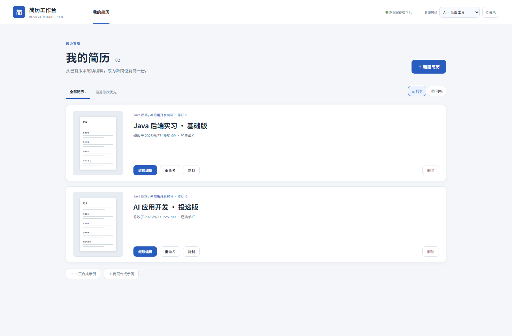
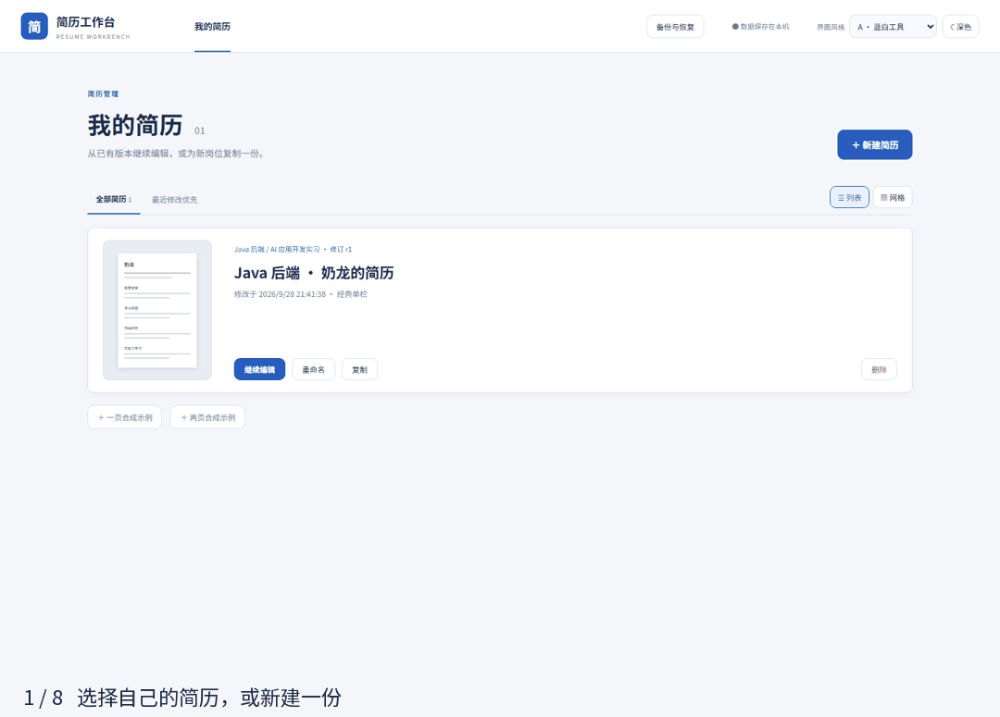
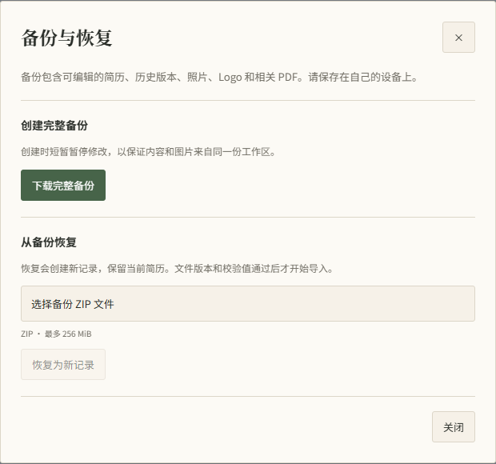

# Resume Workbench · 简历工作台

面向中文技术求职者的本地简历工作台。结构化编辑、实时预览、独立学校 Logo / 证件照、中文 PDF、版本恢复和完整本地备份，不需要注册或模型 Key。



编辑页和深色模式的实际截图：[纸张文档风格](docs/workbench-editor.png) · [深色模式](docs/workbench-dark.png)。



演示使用合成奶龙简历，展示选简历、编辑、撤销、样式与间距、版本对比、PDF 和完整备份。[最新版本与部署配置](https://github.com/MoChiUaena/resume-workbench/releases/tag/v0.5.0)。

## 现在可以做什么

- 在“我的简历”列表选择、新建、重命名、复制和删除简历；从一份基础简历复制 Java 岗和 AI 岗版本。
- 编辑基本信息、教育、工作 / 实习、项目、技能和自定义模块；添加条目、排序、隐藏、按模块另起一页。
- 正文支持段落、项目列表和 `**加粗**`。输入 HTML 会作为文字显示，不接受任意 HTML/CSS。
- 编辑页左侧选模块、中间填写内容、右侧实时预览。界面可选蓝白工具或纸张文档风格，并能独立切换深色模式；选择保存在本机浏览器。PDF 版式可独立选择四种简历模板。
- 两张图片可以独立替换、隐藏、移除、调整尺寸、旋转和裁剪。
- 新建示例使用“奶龙”作为姓名和你提供的证件照原图；保留一张独立的虚构学校 Logo。已有简历的内容不会被模板更新覆盖。
- “版式设置”分为模板、文字、样式、间距：黑体 / 宋体、字号比例与预设、中文 / English 信息标签、八种主题色与自定义色、文字对齐、图标 / 文字标签 / 纯内容、模块标题样式。
- 行距 1.2–2.0、模块间距 0–12 mm，左右 / 上 / 下边距分别为 8–32 mm；还能调整条目和段落间距，并一键恢复默认样式或间距。设置会自动保存，进入历史版本和完整备份。
- 700 ms 防抖自动保存，串行写入；数据库确认后才显示“已保存到本机”。失败可重试或另存副本，修订冲突不覆盖其他页面。
- 手动版本快照和恢复；恢复前自动保留当前版本。导出时记录固定修订的版本快照。
- 顶部“撤销 / 重做”覆盖正文、简历名称、模块、图片与排版，连续输入合并为一步，撤销后的内容仍会自动保存。支持 Ctrl / ⌘ Z、Ctrl Y 和 Ctrl / ⌘ Shift Z；最近 100 步仅保留在当前编辑页面，刷新或重新打开简历会清空，长期保存请使用版本快照。
- 在“历史版本”点击“对比”，查看旧版与当前编辑内容的文字、模块、照片 / 校徽及版式变化，可筛选后恢复；查看不会保存或覆盖草稿。恢复后的结果也能撤销，数据库修订号继续递增。
- 中文 A4 预览与 PDF 共用模板、字体、图片和分页脚本，PDF 保留可选择、可搜索的文字。
- 四种简历模板：经典单栏、并列页眉、横栏名片、侧栏标题。横栏名片将联系方式独立横排，侧栏标题将模块标题放在左侧、正文放在右侧；切换保留正文、图片和文字 / 样式 / 间距设置。网站 A/B 风格仍独立于简历模板。
- 顶部「脱敏 PDF」可独立隐藏姓名、电话、邮箱、位置、证件照和学校 Logo，正文可同步替换相同信息；检查预览后导出副本，原稿保持不变。其他学校、单位和链接仍需在预览中检查，完整备份仍保留原始信息。详见 [脱敏导出说明](docs/redacted-export.md)。
- “备份与恢复”下载包含正文、版式、历史版本、原图、标准化图片和相关 PDF 的 ZIP；可以在全新实例恢复，再继续修改。导入会新增记录，保留现有简历。
- 自动本地备份默认关闭，可选择每天 / 每周，数据有变化才生成副本；重启补做到期检查，失败保留最近成功的副本并重试。本机历史支持手动 / 自动 / 旧版 ZIP 的分页查看、下载和确认恢复，全部已有文件保留。详见 [自动备份与历史](docs/automatic-backups.md)。

阶段 C 的部署、备份和离线闭环已在独立容器中验证。首版为单人本地使用，没有账号、AI、云存储或公开分享功能。`compose.yml` 运行 app / db 两个服务；`compose.dev.yml` 只供源码开发时启动数据库。

## Docker 启动

只需要 Docker Desktop / Docker Compose，无需在宿主机安装 Node、JDK 或 Maven。当前版本为 `0.5.0`，包含自动备份与历史、脱敏 PDF、四种模板、撤销 / 重做与历史版本对比，文档仍使用 schema 4；镜像由版本标签触发 CI，全部检查通过后推送到 GHCR。

从 Release 下载 `resume-workbench-config.zip`，解压后有版本对应的 `compose.yml` 和 `.env.example`。在这个新目录运行：

```powershell
Copy-Item .env.example .env
# 修改 .env 的 RESUME_DB_PASSWORD，使用自己生成的长随机密码
docker compose up -d --wait
```

访问 <http://127.0.0.1:18765>。两个服务会自动初始化数据库；应用端口仅绑定本机，数据库不发布端口。不要将此无认证应用直接暴露到公网。

也可以在本仓库目录从源码构建，工具链全部在 Docker 内：

```powershell
Copy-Item .env.example .env
# 修改 .env 中的默认密码
docker compose up -d --build --wait
```

首次准备镜像、依赖和浏览器需要联网；字体、Chromium 和前端随应用镜像提供。运行时编辑、保存、图片、备份与 PDF 已通过切断外网出口的实际检查。当前镜像验证平台为 Linux amd64 / Docker Desktop，尚未声明 ARM64 支持。

### 停止与升级

```powershell
docker compose stop
docker compose up -d --wait
```

停止、重启或重建容器不会删除数据卷。升级前先在页面下载完整备份并保存到数据卷之外，保留 `.env` 密码；将 `RESUME_APP_IMAGE` 改为目标版本，更新该版本的 Compose 配置，再运行：

```powershell
docker compose pull
docker compose up -d --wait
```

Flyway 自动执行迁移。不要在已有数据库卷上重新生成密码；不要在普通停止 / 升级时删除数据卷。删除 `resume-workbench_resume_pgdata` 会丢失正文和历史，删除 `resume-workbench_resume_data` 会丢失原图、处理图、PDF 和服务器备份。发生不兼容升级时，优先在新实例中恢复备份，不能保证新数据库可直接切回旧镜像。



完整范围、格式版本、大小限制和一致性取舍见 [备份格式说明](docs/backup-format.md)。

## Windows 源码开发

需要 JDK 21、Node.js 22.12+、npm 和正在运行的 Docker Desktop。Maven Wrapper 固定 Maven 3.9.16；首次准备依赖和浏览器需要联网，应用运行使用项目内的字体。

```powershell
git clone https://github.com/MoChiUaena/resume-workbench.git
cd resume-workbench
./scripts/start.ps1 -JavaHome '你的 JDK 21 目录'
```

本次环境已完成依赖准备与构建，后续直接：

```powershell
./scripts/start.ps1 -JavaHome "$env:USERPROFILE/java/jdk-21" -SkipBuild
```

访问 <http://127.0.0.1:18765>。在“我的简历”选择已有版本，或新建空白简历 / 合成示例。右上角的“界面风格”和“深色模式”可以随时切换；这些设置只影响网站界面，不修改简历内容或导出 PDF 的版式。

脚本首次创建被 Git 忽略的 `.env`，生成随机本地数据库密码；启动 `local-resume-dev` Compose 项目的 PostgreSQL，执行 Flyway 迁移，然后启动应用。不会改变其他项目的 JDK 或浏览器配置。

应用仅监听 `127.0.0.1:18765`；开发数据库仅映射 `127.0.0.1:18766`。不支持把此无认证版本直接暴露到公网。Chromium 使用项目 `.tools/ms-playwright` 并禁止共享缓存清理。

`Ctrl+C` 停止应用，不删除数据。若需要同时停止开发数据库：

```powershell
docker compose -f compose.dev.yml stop
```

重新运行启动脚本会继续使用原数据卷。不要删除 `local-resume-dev_resume_pgdata` 卷，也不要在已有数据卷上重新生成 `.env` 密码。删除卷会丢失简历正文和历史版本。开发模式同样支持页面完整备份。

Linux/macOS 提供 `scripts/start.sh`，需要 Docker、JDK 21、Node 和 Chromium 系统依赖；本轮实际验证为 Windows。前端开发可在后端启动后运行 `cd frontend; npm run dev`，本机开发端口为 5173，API、字体和渲染资源由 Vite 代理到后端。

## 使用流程

1. 在“我的简历”中打开已有简历，或新建空白简历 / 合成示例。编辑页左侧选择“项目经历”等模块；中间修改标题、时间和“经历描述 / 正文”，右侧实时显示结果。
2. “图片”中分别导入校徽和照片。支持 JPEG/PNG，默认 5 MiB、2400 万像素、单边 12000 px；透明 PNG 与 EXIF 方向已验证。
3. “版式”选择模板与字体，查看右侧分页。短段落 / 列表条目之间可以自动续页；单条过高时明确报错，避免静默裁掉文字。
   进入“文字”选择字体和字号；“样式”调整主题色、对齐和信息展示；“间距”分别调整左右、上下边距。English 切换信息标签及续页提示，正文保持用户输入，不会自动翻译。网站 A/B 风格和深色模式仍独立于 PDF 的样式。
4. 等到“已保存到本机”。修改正在保存时可以继续输入；新内容排队保存。两个页面同时编辑发生冲突时，保留当前页面内容并选择“另存副本”或“重新载入”。
5. 在“版本”保存快照，或“复制简历”创建岗位变体。恢复旧版会先保留当前版，旧照片仍可读取。
6. “导出 PDF”会先保存最新输入，再为对应修订创建持久快照。导出文件元数据包含简历 ID、快照 ID、修订号及校验值。
7. “备份与恢复”下载完整 ZIP，在新实例中恢复为新记录。文件清单和校验值通过后才导入，历史版本里的旧照片也会保留。

## 数据在哪里

| 数据 | 位置 |
| --- | --- |
| 正文、版式、修订、版本快照、附件元数据和引用 | PostgreSQL `local_resume`；部署卷 `resume-workbench_resume_pgdata`，开发卷 `local-resume-dev_resume_pgdata` |
| 上传原图、标准化图片和附属 metadata.json | `data/attachments/<UUID>/`；部署时 `/app/data` 挂载 `resume-workbench_resume_data` |
| PDF 与对应元数据 | `data/exports/<UUID>.pdf` / `.json` |
| 创建的备份 ZIP | `data/backups/<UUID>.zip`，并下载到浏览器；ZIP 无加密 |
| 本地数据库凭据 | `.env`（不入 Git） |
| 浏览器依赖 | 部署镜像中的 `/ms-playwright`；源码开发为 `.tools/ms-playwright`（不入 Git） |

`RESUME_DATA_DIR` 可指定附件和导出目录；`RESUME_DB_URL`、`RESUME_DB_USER`、`RESUME_DB_PASSWORD` 配置 PostgreSQL；源码 `PORT` 默认为 18765，Compose 宿主机端口通过 `.env` 的 `RESUME_PORT` 调整。`RESUME_MAX_UPLOAD_BYTES` 默认 5242880，前后端共用；备份限制 `RESUME_MAX_BACKUP_BYTES` 默认 268435456。multipart 为较大的图片 / 备份限制额外预留 524288 字节，图片接口仍单独执行 5 MiB 检查。

Compose 的 `.env` 保存部署设置，应与下载的备份分别保留。服务器密码和主机目录不进入 ZIP；界面风格 / 深色偏好仍保存在本机浏览器。自定义 `-p` 项目名时卷名前缀也会变化。

当前源码的结构化文档采用 `schemaVersion: 4`，分离 `content` 与 `layout`；版式样式位于 `layout.presentation`。schema 4 扩展模板标识，数据库结构不变。读取 schema 2 时按原统一边距补齐设置，读取 schema 3 时保留已有设置；不批量改写已保存的数据。文件只通过 UUID 引用，不在正文中保存宿主机路径。移除当前照片不会删除历史文件；删除整份简历会删除它的历史记录，但仍保留图片文件。本阶段没有附件垃圾回收。

`0.3.0` 可恢复 schema 2 / 3 / 4 备份。新备份标识为 schema 4，旧应用会明确拒绝，避免丢失新模板。撤销记录属于当前页面，不进入备份；历史版本仍完整备份。升级前备份并保留 .env 和两个数据卷；读取旧文档只在内存转换，保存修改时才写入 schema 4。不能保证保存新模板后直接切回旧应用，可在独立旧实例恢复升级前备份。

内存中的短期渲染快照保留 30 分钟、最多 64 个；它与 PostgreSQL 中可长期恢复的版本快照不同。浏览器只记住所选简历 ID，不用 localStorage 保存正文。

## 验证与测试

后端测试使用真实 PostgreSQL，在独立 `resume_test` schema 内执行并回滚事务，不使用第二种数据库：

```powershell
. ./scripts/prepare-db.ps1
$env:JAVA_HOME='你的 JDK 21 目录'
./mvnw.cmd test
```

先启动应用，然后另开终端：

```powershell
cd frontend
npm ci
npm run test:unit
npm run build
npm run test:e2e
```

E2E 只删除测试自己创建的简历 ID，不清空工作区。备份界面测试仅在 `RESUME_TEST_ISOLATED=1` 的独立实例启用，避免复制真实用户的工作区。测试覆盖编辑、重开、排序隐藏、照片历史、复制删除、失败重试、保存中的继续输入、双窗口冲突、四种模板 PDF 和长内容分页。数据目录可能保留测试上传文件，尚未实现垃圾回收。

PDF QA 需要 Python `pypdf` 以及 Poppler 的 `pdftoppm`、`pdffonts`：

```powershell
python scripts/verify-pdfs.py
```

产物在 `output/pdf/stage-b-{classic|banner}-{one|two}.pdf`，报告在 `output/pdf-verification-stage-b.json`，E2E 报告在 `output/e2e-results.json`。逐字检查中文和标题顺序，不用 NFKC 归一化掩盖部首替换错误。`--stage-a` 只用于检查保留的阶段 A 旧样本。

当前源码的验证包含 9 项前端逻辑测试、50 项 Java 测试、24 项浏览器测试，以及中文 PDF、全新实例恢复和排版边界检查。`scripts/verify-backup.py --isolated` 在两个空实例执行恢复检查；`scripts/verify-automatic-backups.py --isolated` 验证自动副本与实例策略；`scripts/verify-pdfs.py --stage-c` 检查两模板与恢复样本；`scripts/verify-layout-pdfs.py` 检查自定义样式、重置和七页边界样本。新增模板检查见 [四模板验收](docs/templates-verification.md)。运行恢复检查后，`scripts/verify-redacted-pdfs.py` 检查四模板脱敏、独立选择和恢复后的 PDF；详见 [自动备份验收](docs/automatic-backup-verification.md)、[脱敏导出验收](docs/redacted-verification.md)、[排版控制验收](docs/layout-verification.md) 和 [撤销与版本对比验收](docs/history-verification.md)。

详情见 [阶段 C 验收记录](docs/stage-c-verification.md)、[阶段 B 验收记录](docs/stage-b-verification.md) 和 [阶段 A 记录](docs/stage-a-verification.md)。GitHub Actions 自动运行这些检查并保存合成数据的报告；它们的远端结果需查看实际运行记录。

## 技术与取舍

JDK 21 / Spring Boot 3.5.16 / PostgreSQL 16.10 / Flyway / Playwright Java 1.63.0；Vue 3.5.43 / Vite 8.3.1 / TypeScript 5.9.3。依赖由 POM、Boot BOM 与 npm lockfile 固定。

- `ResumeService` 用事务与修订号控制更新；mutation ID 处理最近一次保存重试。
- `AttachmentStorage` 隔离图片存储实现，当前只使用本地文件；当前简历与版本各自保留外键引用。
- `PreviewService` 将输入深拷贝为渲染快照；`paginate.js` 在字体、图片就绪后测量排版，预览与导出共用。
- 分页按条目 / 段落边界切分，最多 10 页；超长单条内容会拒绝导出。不是通用文字处理器，也不提供任意画布。
- 黑体和宋体均本地嵌入，修复共享字形的 Unicode 反向映射；不承诺所有 ATS 系统兼容。

字体、来源散列与许可见 [THIRD_PARTY_NOTICES.md](THIRD_PARTY_NOTICES.md)。原创代码和脚本绘制的合成素材采用 MIT；用户提供的示例证件照不在此许可范围内。版本发布流程见 [发布说明](docs/releasing.md)。

进一步阅读：[架构与设计](docs/architecture.md) · [依赖许可证清单](docs/dependency-licenses.md) · [参与开发](CONTRIBUTING.md) · [更新记录](CHANGELOG.md)。
