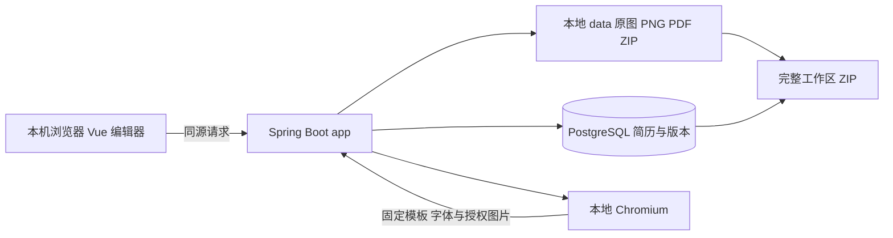
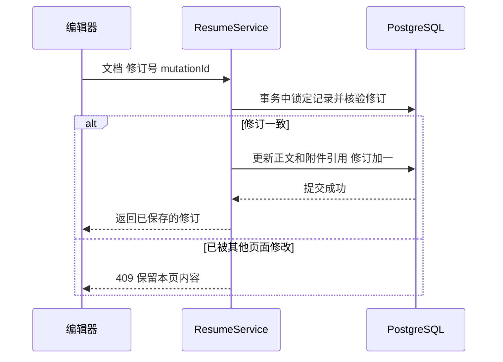

# 架构与设计取舍

Resume Workbench 是单人本地工作台。一个 Spring Boot 进程提供构建好的 Vue 页面、API、图片处理和 Chromium PDF；PostgreSQL 保存正文、版本和附件引用，文件写入本地 data 目录。默认 Compose 只运行 app / db，应用端口绑定到宿主机 127.0.0.1，数据库不发布端口。

## 文档、版本与图片

`ResumeDocument` 的 schema 3 分离 content 与 layout。正文采用结构化模块，有限 Markdown 只支持段落、列表和加粗；HTML 会转义。layout 包含两个模板、字体、字号、行距、两个图片槽位和 presentation 样式。不存在任意 HTML/CSS 注入或自由画布。

schema 2 文档读取时在内存补齐默认样式和原有边距，不批量更新数据库；只有用户保存修改时写入新文档。备份 manifest 同时标识文档 schema，旧应用明确拒绝 schema 3，避免悄悄丢失排版设置。

数据库中的 resumes 保存当前文档、修订和最后一次 mutation ID；resume_versions 保存可长期恢复的快照。resume_assets / version_assets 分别引用稳定附件 UUID。照片与 Logo 独立配置，替换或隐藏当前照片不删除历史版本仍需的原图。当前没有垃圾回收，删除整份简历后可能保留无引用文件。

`AttachmentStorage` 是存储边界，目前只实现 LocalFileStorage。每个 UUID 文件夹保存原文件、标准化 PNG 和 metadata.json，记录内容格式、像素、EXIF 方向及两份 SHA-256。上传先验证内容格式和尺寸，再解码、校正方向；默认 5 MiB / 2400 万像素。SVG、HEIC、WebP 尚未声明支持。

## 自动保存与并发修改

浏览器将输入防抖 700 ms，并串行写入。请求带 expectedRevision 和 mutationId；ResumeService 在事务中锁定记录、核验修订、更新正文和引用。重复发送最近一次 mutation ID 不会再次增加修订。数据库确认后才显示已保存，网络或数据库失败时保留页面内容。

两个页面编辑同一修订时，后保存者收到 409 REVISION_CONFLICT，可以重新载入或另存副本，不覆盖先保存的页面。恢复历史版本前先保存当前快照，为误恢复提供回退入口。

## 预览和 PDF 一致性

PreviewService 将文档序列化后重新读取，形成不可变的渲染输入。临时预览快照保留 30 分钟、最多 64 个，与数据库历史版本分开。Thymeleaf 模板、print.css、paginate.js 同时用于浏览器预览与导出；字体与图片完成加载后才测量排版。

分页按条目 / 段落边界续页，检查正文下边距和页脚安全空间，最多十页。单条内容过高会明确拒绝导出，不静默截断。字体嵌入，PDF 文本可选择和提取；不保证所有 ATS 系统的解析表现。

导出先核验当前修订并创建持久版本，再渲染固定文档。后续编辑不会混入该 PDF。ExportService 并发为 1，设定浏览器启动、导航和测量超时；仅允许请求这份模板、指定本地字体、脚本和所引用的图片，不接收任意 URL。PDF 与审计元数据存入 data/exports。

## 备份与恢复的事务边界

普通写入持有共享锁，备份 / 导入持有排他锁。备份在 PostgreSQL 可重复读事务中读取当前记录和历史，继续持锁直到必要附件与 PDF 打包完成。它使用应用级一致快照，不拷贝正在写入的数据库文件。

ZIP 有格式版本、文件白名单、大小和 SHA-256；恢复先在临时目录完成校验，拒绝路径越界、重复 / 多余文件、损坏内容和解压超限。实际导入在数据库事务中执行，给简历、版本和附件分配新 UUID 并重映射引用。现有记录不覆盖，导入失败只清理本次新文件。成功提交后的临时目录清理失败不会撤销恢复。

文件系统和数据库没有分布式事务。这套补偿清理覆盖可检测的存储 / 数据库失败；若进程在提交前直接崩溃，可能留下无引用的新文件，但不会覆盖既有文件。部署应仅运行一个 app 写入同一套数据库 / data，锁不跨进程。

## 本地边界与部署

LocalRequestFilter 校验本机 Host、同源 Origin、Sec-Fetch-Site 和写入请求头，并设置 CSP、no-store 等响应规则。它适用于单人本机使用，不是公网身份认证，不应把无认证端口直接开放到网络。

运行期核心功能不调用模型、云存储、字体 CDN 或在线 PDF 服务。安装镜像 / 依赖需联网，已在切断 app 默认外网路由的容器中验证运行流程。将来接 AI 时仍需单独设计发送字段、服务商展示和用户确认，不能静默把整份简历发到云端。

选择 PostgreSQL 是为了事务、修订并发和迁移的清晰边界；代价是多一个容器。首版不并行维护 SQLite、S3、多租户或消息队列。两个模板与有限参数使测量、分页和回归测试的范围可控。

可在面试中结合 ResumeService、ImageService、PreviewService、ExportService、BackupService 和相应测试，解释上述边界；测试记录见 stage-c-verification.md 与 layout-verification.md。
