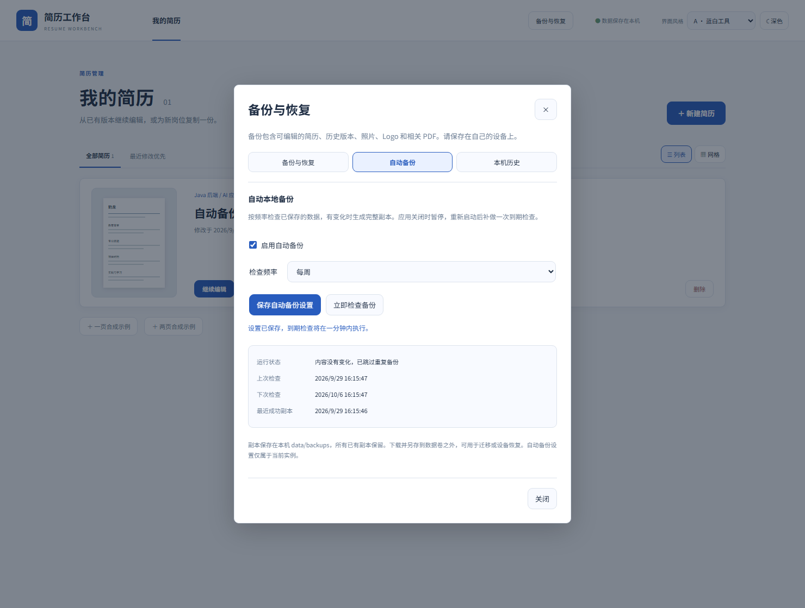
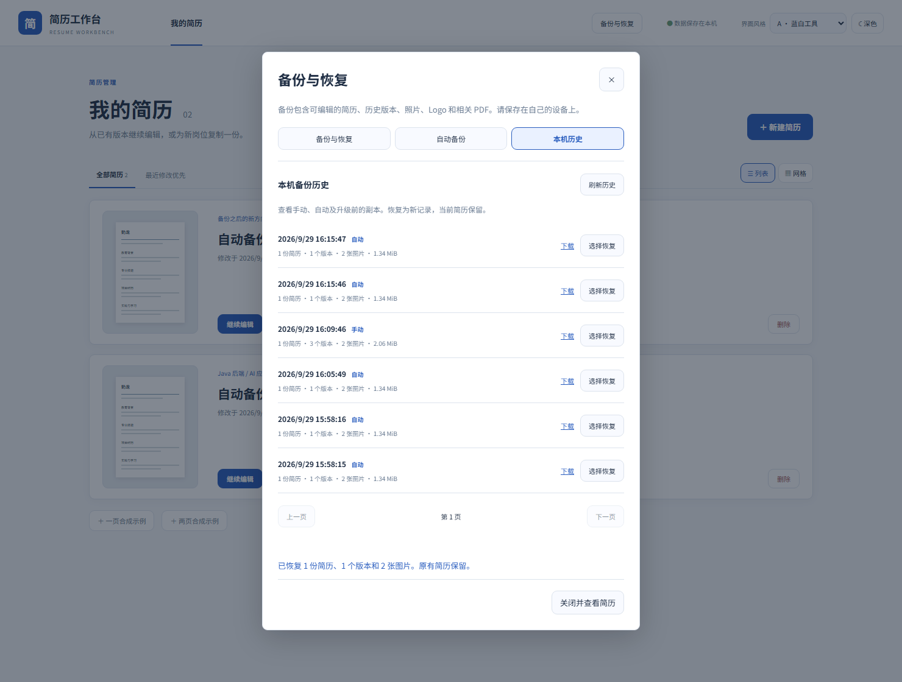

# 自动备份与历史验收

2026-09-29，Windows / JDK 21 / Node 24 / Docker Desktop，使用独立 `resume-automatic-source`、`resume-automatic-target` 和 v0.4.0 升级实例，数据为合成奶龙简历。





## 实际检查

- 9 项前端逻辑、50 项 Java 测试通过；覆盖每日 / 每周到期、重启补检查、稳定指纹去重、失败保留最近成功副本、五分钟重试、损坏设置暂停、写入失败不启用、并发检查不重叠。
- 旧 ZIP 摘要、整体 ZIP 校验值、完整恢复、分页和真实创建时间排序通过；复制旧文件改变文件时间不会把它错误排到最新，无法读取的条目保留在磁盘。
- 切断两个应用容器的默认外网路由后，全部 24 项浏览器流程通过。新流程实际启用策略并等待调度生成基线，立即检查跳过重复内容；修改后产生新副本，下载并从历史恢复为新记录，当前简历保持一致。A/B、深色、窄屏、焦点和未保存设置也已检查。
- 完整重跑曾发现测试过早读取上一次的 created / 已关闭状态。等待本次的新副本 ID、实际检查响应及设置保存完成后，24 项完整流程全部通过，没有放宽业务校验。
- 自动 ZIP 在另一实例恢复后，正文和照片 / 校徽的 SHA-256 与原稿一致，目标原有记录保留；目标自动备份仍关闭，证明策略没有随 ZIP 迁移。
- 保留数据卷重建两个容器后，策略开关、每周频率、下次检查、最近成功副本和 ZIP 字节校验值保持一致，历史仍能找到相同副本。
- v0.4.0 同源缓存镜像升级后，正文、版式、修订、日期、图片、版本和既有 PDF 保留，升级前 ZIP 显示为旧版历史；自动备份默认保持关闭。
- 原有四模板、字号 / 间距边界、普通 / 脱敏 PDF、跨实例恢复和容器重建回归通过。应用 JAR 的 53 个运行依赖与许可证散列核验一致。

本机应用更新前另外创建了完整备份，当前用户文档的语义散列、修订和更新时间保持一致。该实例原有七份 ZIP 都可读取，自动备份仍关闭；私有数据和指纹证据未进入仓库。

## 重复运行

在两个显式隔离的实例设置 `RESUME_TEST_BASE_URL` 与 `RESUME_TEST_ISOLATED=1`，运行完整浏览器流程后：

```text
python scripts/verify-backup.py --isolated
python scripts/verify-automatic-backups.py --isolated
```

保留卷重建两个容器，再执行两个脚本的 `--check-persistence`。报告为 `output/automatic-backup-verification.json`，ZIP、PDF 和私有部署文件位于被 Git 忽略的位置。

CI 重复上述流程，并使用实际公开 rc.1、v0.2.0、v0.4.0 镜像验证旧数据和备份。发布后，匹配标签的匿名安装检查再次验证自动副本与跨实例恢复；远端结果以相应 Actions 运行记录为准。
