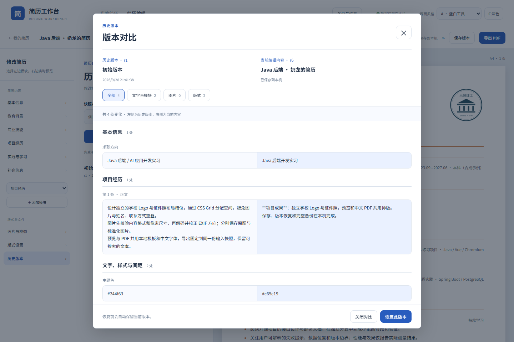

# 撤销与版本对比验收

2026-09-28，Windows / JDK 21 / Node 24.18.0 / Docker Desktop，使用独立的 `resume-history-source` / `resume-history-target` 实例及合成简历。既有用户工作区未参与恢复测试。

## 实际结果

- 9 项前端逻辑测试通过：连续输入分组、失焦边界、撤销后分支、重复保存确认、容量边界，以及稳定 ID 下的模块 / 条目顺序、增删、图片、样式和空值对比。
- 35 项 Java 测试通过：新增版本详情读取保持当前正文 / 修订 / 版本数量不变，跨简历和不存在的版本明确拒绝。
- 15 项浏览器流程完整通过：Ctrl Z / Ctrl Shift Z、中文输入法事件、模块删除与版式撤销、保存中的撤销、保存失败撤销、切换简历隔离、未保存草稿对比、旧图片读取、HTML 文字转义、筛选、焦点循环 / 返回、Esc、深色与窄屏、恢复失败重试和恢复后撤销 / 重开。
- 全新实例完整备份恢复成功：结构与文件校验值一致，历史照片可恢复，导入后可继续编辑并导出。
- 可执行 JAR 的 53 个运行期依赖、许可证、入口和应用版本核验通过。PDF 使用原有共用渲染链路，导出与布局检查按发布工作流重复验证。



## 保存与恢复的边界

撤销记录只保存标题和文档的副本，最多 101 个状态（最近 100 步），不保存服务器修订号。相同输入元素在 800 ms 内的连续输入合并为一步；失焦、点击或离散操作结束分组。新编辑会清除重做分支。

撤销只替换本页草稿，后续仍由原有串行写入使用最新修订号保存。进行中的保存先完成，再保存撤销结果；失败不替换草稿。打开另一份简历、重新载入或刷新页面会重置撤销记录，数据库历史版本不受影响。恢复历史版本作为一个可撤销步骤加入当前编辑记录。

响应丢失的保存保留原始请求及 mutation ID，并保持待确认状态。再次保存时先确认原请求，再保存最新草稿；撤销回此前已保存的内容也不会跳过这一步。浏览器测试用“后端成功写入后中断响应”验证确认请求复用原 ID、最终正文恢复、修订继续递增。

版本详情通过 `GET /api/resumes/{id}/versions/{versionId}` 读取，按两个 ID 同时核验归属。查看对比不调用保存、快照或恢复；对比基于当前草稿，因此能显示尚未保存的修改。实际恢复仍先保存当前内容，再调用原恢复事务，保留恢复前快照。

差异按模块 / 条目的稳定 ID 对齐，分别标记增删、排序、文字、显隐、图片配置和版式。正文以 Vue 文字插值展示，照片从已有本地附件读取，不执行正文 HTML。

尚未填写标题的新模块显示为“未命名模块”，查看不会强制保存。冲突后另存副本会同步更新编辑页地址，刷新继续打开副本。

文档继续使用 schema 3，未新增数据库迁移。0.1.0 的当前简历、版本和备份与本版兼容。短期撤销记录不进入备份，长期版本快照仍完整备份。

## 重复执行

执行 `npm --prefix frontend run test:unit` 和前端构建；后端测试使用已有独立测试 schema。浏览器验证指向独立实例：

```powershell
$env:RESUME_TEST_BASE_URL='http://127.0.0.1:18767'
$env:RESUME_TEST_ISOLATED='1'
npm --prefix frontend run test:e2e
```

生成的 JSON、截图及 PDF 位于被 Git 忽略的 `output/`。CI 包含同样的逻辑 / 浏览器验证，并在阻断外网的测试容器中执行恢复与 PDF 检查。
