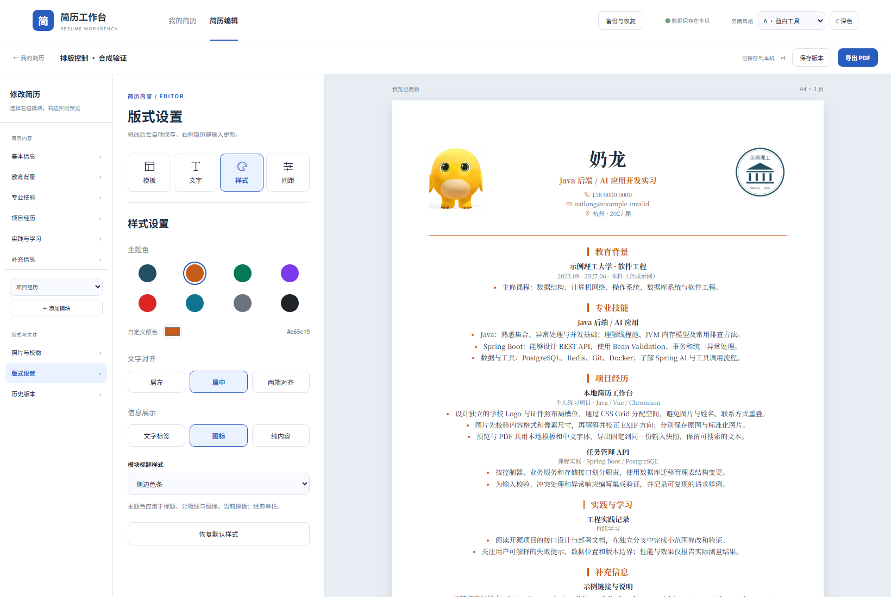

# 排版控制验收

2026-09-28，新增“模板 / 文字 / 样式 / 间距”面板，保留网站 A/B 风格和独立深色模式。实际界面截图使用合成奶龙简历：



## 可以调整的内容

- 文字：内置 Noto Sans SC 黑体、Noto Serif SC 宋体；9–12 pt 滑块与 95% / 100% / 110% 预设。姓名、标题、信息和正文按同一比例缩放。
- 语言：中文 / English 的信息标签与续页提示。用户填写的正文不自动翻译。
- 样式：八种主题色、自定义颜色、居左 / 居中 / 两端对齐；文字标签、图标或纯内容；跟随模板 / 横线 / 侧边色条 / 简约模块标题。
- 间距：模块 0–12 mm、行距 1.2–2.0；左右、上、下边距各 8–32 mm；条目 0–8 mm、段落 / 列表 0–4 mm。恢复默认样式或间距不会修改正文。
- 自动保存、实时预览、版本恢复与完整备份均包含这些设置；PDF 共用同一份模板与分页规则。页脚额外保留安全空间，防止较小下边距导致重叠。

## 实际验证结果

34 项后端测试和 11 项浏览器测试全部通过，测试在独立 schema / Compose 项目进行，应用容器移除默认外网路由后仍可使用。

排版浏览器测试执行真实点击和滑块键盘操作，检查保存、重开、字体、主题色、边距的实际 CSS 像素值、信息图标、版本恢复和 PDF 导出；A 与 B 深色模式均检查截图。恢复默认设置后字体和正文保留。

三份新增 PDF 分别验证自定义宋体 / 橙色 / 居中 / 独立边距、一键重置，以及最大字号 / 行距 / 边距 / 间距。前两份为一页，边界样本为七页；30 条正文逐条检查仅出现一次。中文原字符、A4、内置字体和所有页面的底部留白通过检查，已用 Poppler 渲染进行视觉检查。

旧的两个模板一页 / 两页 PDF、图片和备份恢复流程也再次通过。旧 schema 2 备份恢复为 schema 3 时继承原统一边距与默认外观；新设置可随当前记录、历史版本和备份完整恢复。既有用户简历的数据库修订号和正文散列在更新前后相同。

```powershell
# 指向自己的独立测试实例，勿使用真实工作区
$env:RESUME_TEST_BASE_URL='http://127.0.0.1:18767'
$env:RESUME_TEST_ISOLATED='1'
cd frontend
npm run test:e2e
cd ..
python scripts/verify-layout-pdfs.py
```

本地报告在 `output/e2e-results.json` 和 `output/layout-pdf-verification.json`；GitHub Actions 同样执行排版浏览器与 PDF 检查。正式发布前应在目标版本的镜像上执行全套检查，不覆盖已有发布标签。
