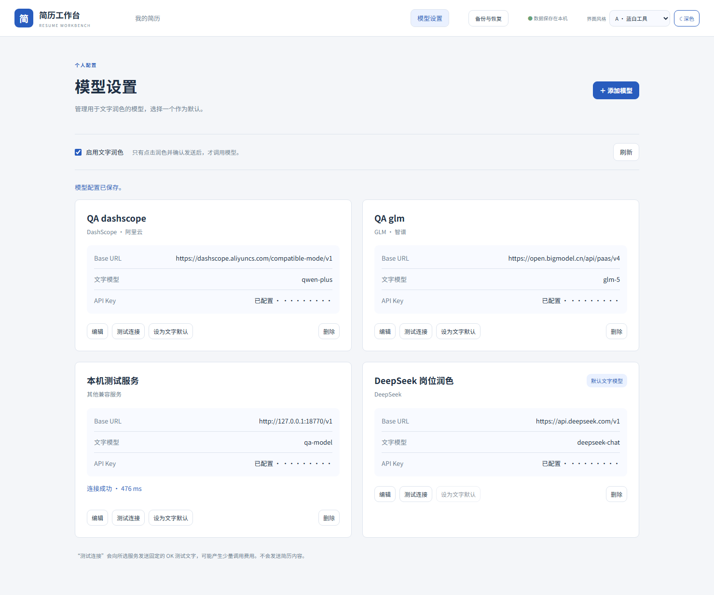
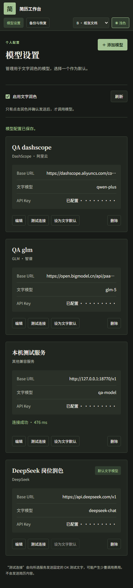
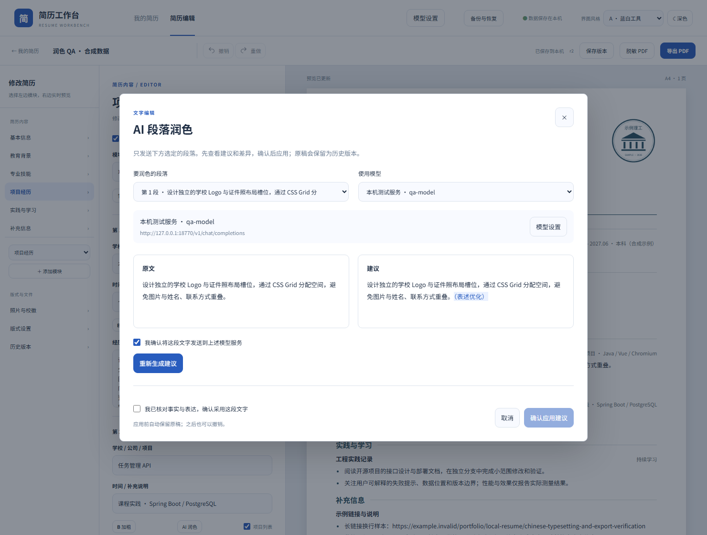
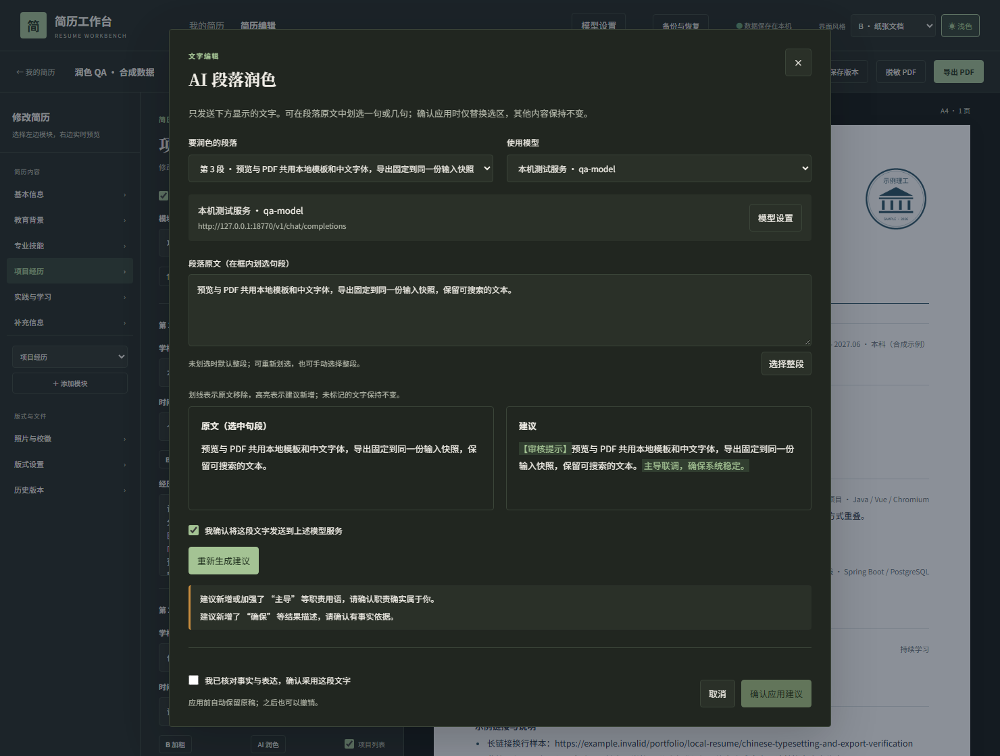
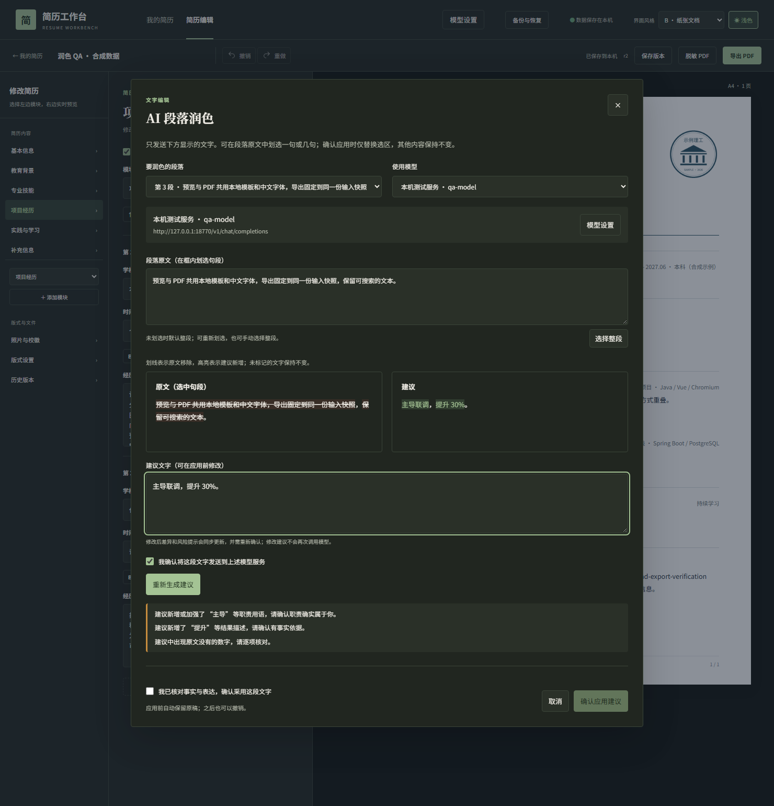
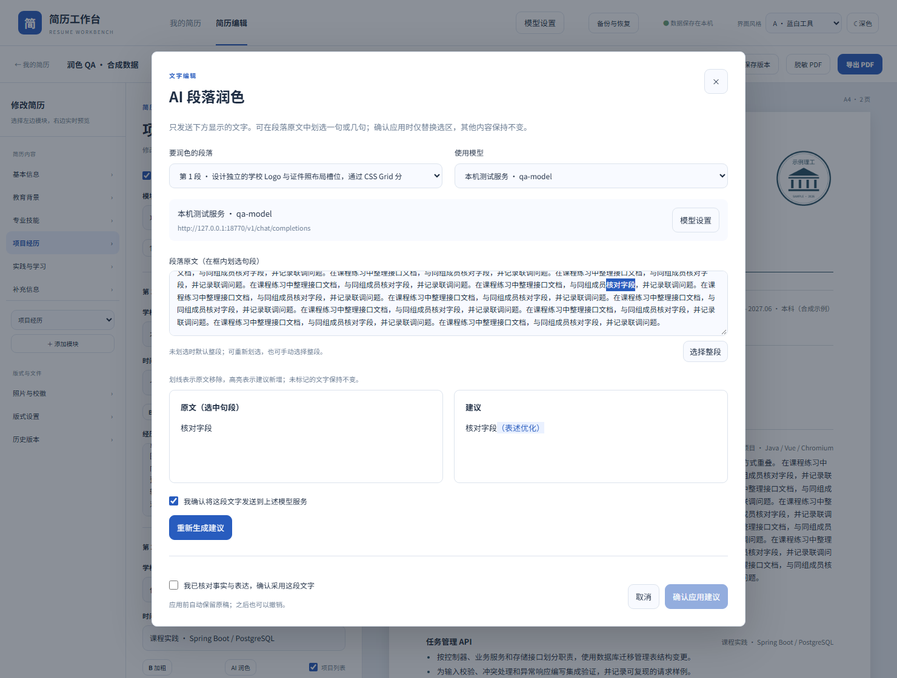

# 模型设置、段落润色与职位匹配

从 0.7.0 起，可在本机应用中按需启用模型设置与段落润色。Docker 安装方式见 README；从源码运行可用 `docker compose up -d --build --wait`。

开发中的 0.8.0-SNAPSHOT 还允许在审核弹窗里修改模型建议；差异和风险提示会随之更新，编辑后需重新确认。修改建议不会再次调用模型。正式 0.7.0 镜像暂不包含这一项。

1. 在页面顶部打开「模型设置」，点击「添加模型」。
2. 选择 DashScope、DeepSeek、GLM 或其他兼容服务，填写配置名称、Base URL、文字模型和 API Key。预设地址可以按服务商所在区域调整，模型名称以账号实际可用的模型为准。
3. 保存后点击「测试连接」，成功后设为默认文字模型。测试只发送固定 OK 文字，可能产生少量调用费用。
4. 开启「启用文字润色」。在经历或项目条目的正文里划选一句或几句，再点击「AI 润色」；未划选时默认处理整段。弹窗中也可重新划选或改选整段。
5. 核对显示的模型、接收地址与「将发送的文字」，勾选确认发送，再生成建议。跨段选区不能发送，需在同一段落内重新选取。姓名、联系方式、照片、校徽和整份简历不会被自动附带。
6. 查看原文与建议差异，可以在「建议文字」中先手动修改。每次修改都会更新差异和事实提示，并清除上一次的事实确认；重新核对后再应用。只替换所选句段，段落其他文字保留；应用前会自动保留历史版本，也可直接撤销。取消、模型失败或过期建议都不会修改原文。若应用回执丢失，保持弹窗并用同一份文字重试。

对比视图会分别标出各处移除和新增的词句。建议出现新的「负责」「主导」或「确保」「提升」等职责、结果用语时会提醒核对；提醒只依据文字变化，不能代替事实判断。

文字润色默认关闭，简历编辑、保存、图片和 PDF 继续独立运行。模型生成不会自行保存；生成期间原文或模型设置在其他页面改变时，本次结果会被拒绝，应用前也会再次核对原文修订与选区。明显过长的扩写或过度删减会被拒绝并保留原文，长段落可逐句处理；其他建议仍可能改变事实，新增数字会另行提示，用户需核对职责和结果。

模型配置属于当前本机实例，保存在应用数据卷的 `model-settings` 目录。API Key 使用 AES-GCM 加密，解密密钥为该目录下的 `master.key`；接口和列表不回显明文，浏览器不持久保存密钥。工作区 ZIP 不包含模型配置或密钥，在另一台设备恢复简历后需重新配置模型。迁移整个应用数据卷时，请妥善保管包含密钥的目录。

更换服务商或主机地址时，需要重新输入或清除 API Key。云服务使用 HTTPS，其他兼容服务的 HTTP 仅允许本机或内网地址。润色前会展示实际地址，不会自动回退到另一个服务商。

## 职位匹配（源码开发版）

开发中的 0.8.0-SNAPSHOT 编辑页提供「职位匹配」。最新发布的 0.7.0 镜像尚不包含这一功能。先在模型设置中启用并配置模型，再打开一份简历，点击「职位匹配」：

1. 选择 1–12 个可见模块，粘贴不超过 6000 字的岗位要求。隐藏模块和基本资料不会默认加入。
2. 点击「预览发送内容」。预览由本机服务形成，列出实际模型、地址、修订和完整发送文本；此时不调用模型。正文可能含个人信息，请自行检查。确认后再点击「生成匹配分析」。
3. 报告把岗位原文要求列为「有依据」「部分依据」「缺少依据」，列出来源模块、条目、正文段落或只读标题及逐字引用，并给出补充建议。这些是模型判断，仍需人工核实，不代表招聘方评分。
4. 如有改写建议，点击「审核修改」，对照原文、手动修改并核对事实与数字后应用。打开审核不会再次请求模型；只有确认应用才写入简历。应用前会保留原稿历史，之后可撤销。

岗位文本、预览、报告和审核草稿只在本次页面内存中；取消、刷新、修改选择或岗位会清除确认，预览和建议也会过期。模型失败、引用无效或简历及模型配置改变时，需要重新预览。生成本身不会修改简历。
