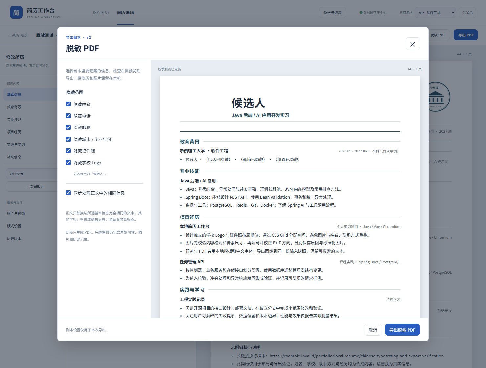

# 脱敏导出验收

2026-09-29，Windows / Node 24 / JDK 21 / Docker Desktop，使用独立的 `resume-privacy-source`、`resume-privacy-target` 和 v0.3.0 升级实例。所有测试数据为合成奶龙简历，未操作实际用户工作区。



## 实际结果

- 9 项前端逻辑测试、43 项 Java 测试通过。新增检查覆盖不可变投影、独立选项、长字符串优先、字面匹配、替换不递归、英文占位符、明确提供选项、只读预览、修订冲突和预览摘要变化。
- 两个应用容器切断默认外网路由后，22 项浏览器流程全部通过，包括四模板脱敏、副本命名、原稿 / 图片 / 版式 / 修订 / 日期保留、下载失败后复用文件、晚到的预览响应、旧 iframe 消息、取消后重置、A/B 深色与窄屏键盘操作。
- 四个模板各有一页与两页 PDF，默认隐藏的姓名、电话、邮箱和位置在提取文本中不再出现；所有页眉、续页和页脚使用候选人，图片流数量为零，PDF 元数据不含上述已知信息。
- 独立保留电话和证件照的样本仍可提取电话，含一张照片，校徽及其余选定信息被移除。
- 跨实例恢复核对全部文件校验值；普通 / 脱敏 PDF 都保留，原稿及历史 EXIF 照片仍可恢复并继续编辑。恢复后的脱敏 PDF 字节和 SHA-256 与原文件一致。
- 十份新增 PDF 共十五页完成 Poppler 渲染检查，A4、中文字形、阅读顺序、页脚及长链接正常；没有使用 Unicode 字形归一化。
- 本地使用缓存的 v0.3.0 同源镜像，在保留数据库 / 文件卷的情况下换新版，正文、样式、修订、日期、图片、历史和旧 PDF 保持一致；旧备份可恢复，新脱敏导出不改变恢复后的原稿。

这里只处理用户选择的基本信息、图片及正文中相同文字。其他身份信息需要结合预览检查；完整备份保留原始信息。具体边界见 [使用与 API 说明](redacted-export.md)。

## 重复验证

在两个空的独立实例中设置 `RESUME_TEST_BASE_URL` / `RESUME_TEST_ISOLATED=1`，运行：

```text
npm --prefix frontend run test:e2e
python scripts/verify-backup.py --isolated
python scripts/verify-redacted-pdfs.py
```

既有 `verify-pdfs.py --stage-c`、`verify-layout-pdfs.py`、`verify-template-pdfs.py` 保留普通导出与分页回归。报告为 `output/redacted-pdf-verification.json`，全部渲染页和合成 PDF 位于被 Git 忽略的 `output/pdf/`。

CI 重复全部检查，并从实际公开 rc.1、v0.2.0 和 v0.3.0 进行保留卷升级。发布后，匹配标签的匿名安装检查验证原稿可编辑与恢复后的脱敏 PDF；远端结果以对应 Actions 运行记录为准。
