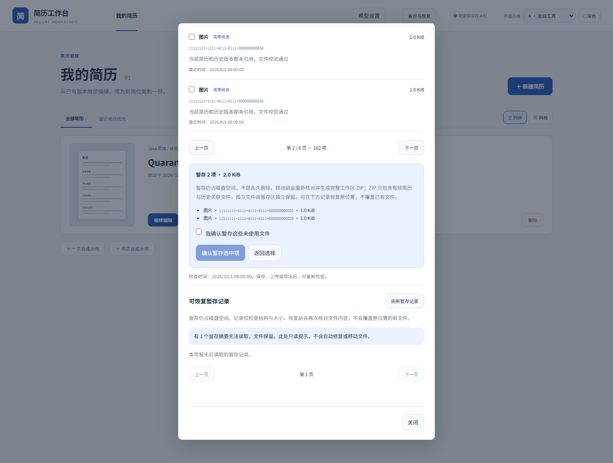
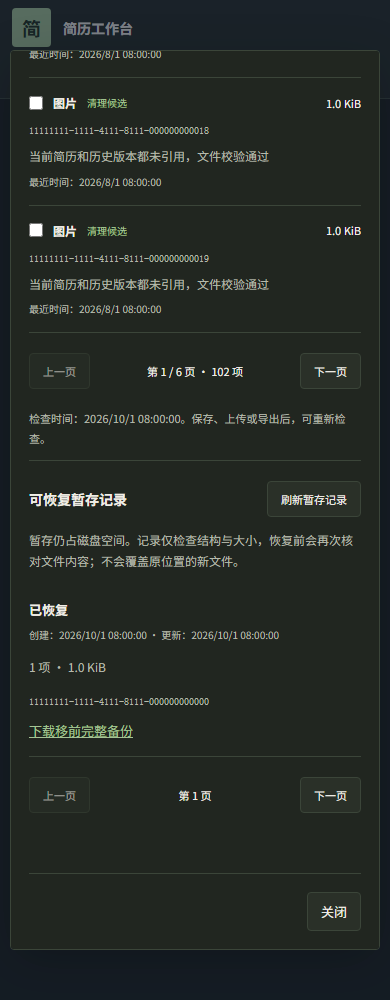

# 空间占用与清理预览

从 0.8.0 起，可在“备份与恢复”中使用空间检查、暂存恢复与确认后的永久清理。安装和启动方式见 README。

在页面顶部打开“备份与恢复”，选择“空间检查”。应用会短暂暂停保存，核对当前简历、历史版本、图片和 PDF 文件，显示统计结果。检查只读取数据，所有文件继续保留。

结果分为六类：

- **仍在使用**：图片仍被当前简历或历史版本引用，包括被隐藏的图片；PDF 仍对应有效简历与历史版本。
- **近期文件**：已失去引用，但最近 30 天内创建或修改，暂时保留。刚上传且尚未保存的图片也可能属于这一类。
- **清理候选**：超过 30 天且没有有效引用；文件结构、元数据与 SHA-256 校验通过。
- **需要检查**：文件缺失、摘要不一致、校验失败、未知文件、链接或其他异常情况。无法完整核对简历引用时，不会给出清理候选。
- **已永久清理**：文件已删除，当前占用为 0 B。清理摘要保留，不能从记录恢复。
- **已暂存**：完整批次已移至本机可恢复暂存区，仍占磁盘空间。结构不完整或异常的批次会显示为“需要检查”，并保留对应的恢复或继续清理入口。列表中的结构与大小检查不代表已经重新核验全部内容；恢复前会核验文件内容。

可以筛选文件范围，或在保存、上传、导出后点击“重新检查空间”。页面显示文件 ID、类型、大小和原因，不返回简历正文、原始文件内容或未知文件名。

只有“清理候选”提供选择框。可以选择本页候选，再逐页选择其他候选；跨页保留选择，页面显示所选数量与体积。每批最多 100 项、1 GiB；超出上限时不能再选。点击“查看暂存清单”，核对文件 ID、数量和体积，勾选确认后再点击“确认暂存选中项”。选择文件和打开页面都不会移动文件。

移动前会重新核对引用与文件，并生成、核验一份完整工作区 ZIP。检查结果已经过期或内容发生变化时，本次移动会被拒绝，请重新检查后选择。ZIP 只包含有效简历和历史版本关联的文件，孤立文件由暂存区独立保留。备份 ZIP、模型配置与密钥不在移动范围内。

暂存仍占本机磁盘空间，页面不会将其计为已释放空间。完整暂存批次可经下载文件 ZIP 和再次确认后永久清理。应用没有自动清理或定时清空暂存区的功能。

网络中断时，暂存或恢复可能已经执行但回执未到达。页面会保留并锁定原选择、操作与检查摘要；请保持页面，点击“用同一清单重试暂存”或“用同一请求重试恢复”。相同请求不会重复生成备份或再次移动同一批文件。

页面下方“暂存与清理记录”按每页 20 条显示状态、创建和更新时间、数量与原批次体积；已永久清理记录另显示当前占用 0 B，并提供移前备份下载链接。点击“查看恢复清单”，勾选确认后点击“确认恢复原位置”。恢复保留原 ID 与字节内容，并让文件重新进入 30 天保护期。恢复不会覆盖原位置新出现的文件；有冲突、文件缺失或损坏时保留记录与文件，可处理冲突后重试。

“准备中”“暂存中”“恢复中”“需要恢复检查”都表示操作尚未完整完成。即使请求返回了记录，也不能将这些状态当作移动或恢复成功。备份失败可能留下“准备中”的记录，可查看恢复清单并明确确认恢复。摘要无法读取时只显示警告，应用不会根据损坏摘要自动修复或移动文件。

完整批次校验通过后，如果完成记录的保存遇到磁盘写入错误，文件会保留在暂存区。请检查“暂存与清理记录”，排除存储故障后明确确认恢复；原位置有新文件时仍会拒绝覆盖。

只有完整的“已暂存”批次提供“查看永久清理清单”。先核对文件清单，点击“生成暂存文件 ZIP”，然后下载 ZIP 并保存到其他位置。文件 ZIP 包含本批次原图、处理后图片、PDF 与文件元数据；可以解压 `files` 目录取回文件。它不包含简历或历史，不能作为完整工作区导入。移前完整备份只包含有效关联文件，不能替代本批次文件 ZIP。

下载后点击“检查下载完成状态”。服务端确认全部字节完整送达且下载证明仍有效后，还需勾选“我已将 ZIP 保存到其他位置并确认可用”，准确输入批次末六位，再点击“确认永久清理”。下载中断、状态无法确认或证明过期时不能永久清理；过期后可重新生成并下载。服务端下载确认并不代替您检查已保存的副本。

永久清理不可撤销。完成后只保留摘要，显示“已永久清理”和当前占用 0 B，不提供恢复入口。原批次体积仅是历史信息，不代表当前占用。清理前会再次核对文件和当前、历史引用；新出现的引用或文件变化会拒绝清理。

“永久清理未完成”表示部分步骤已执行，请从“继续永久清理”核对已保存的 ZIP，再勾选确认并输入批次末六位继续。已经开始的清理证明随记录保留，重启后仍可明确确认继续；打开记录、检查状态或启动应用都不会自动删除剩余文件。

生成文件 ZIP 或永久清理的回执未知时，父窗口和确认内容保持锁定。请保持页面，使用“用同一请求重试生成 ZIP”或“用同一请求重试永久清理”，避免改变批次或下载证明。

已统计空间包含图片、导出目录与暂存区中可统计的项目。异常目录不递归读取；若无法统计内部大小，页面会提示实际占用可能更高。备份 ZIP、模型配置和密钥不在检查范围内。

完整清单按每页 20 项显示，筛选后可以逐页查看。本次最多遍历 20,000 个目录项；候选文件的流式校验总量最多为 1 GiB，超出部分列为“需要检查”。遍历或校验达到 20 秒后会停止并提示检查未完成；文件继续保留。数据库记录与文件读取权限异常时同样停止检查。
