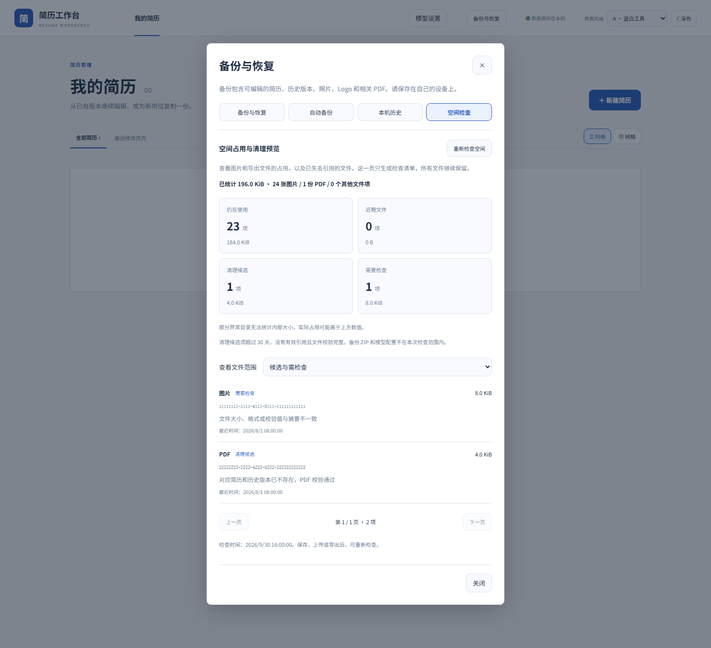
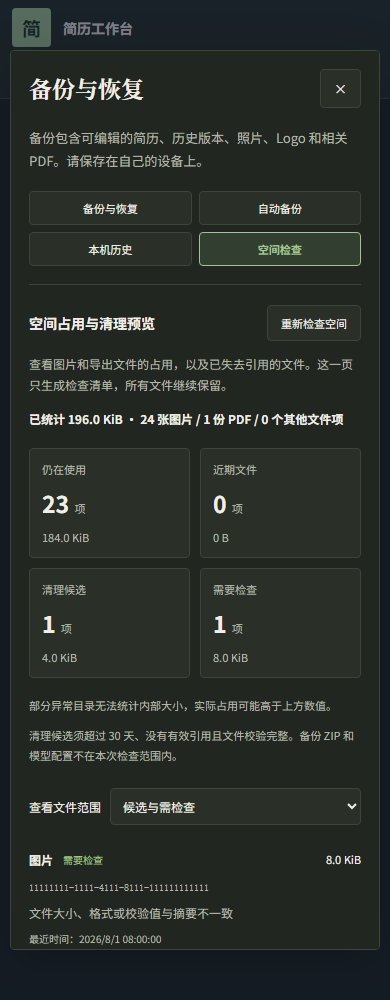

# 空间占用与清理预览

开发中的 0.8.0-SNAPSHOT 提供此功能，正式 0.7.0 镜像暂不包含。源码运行方式见 README。

在页面顶部打开“备份与恢复”，选择“空间检查”。应用会短暂暂停保存，核对当前简历、历史版本、图片和 PDF 文件，显示统计结果。检查只读取数据，所有文件继续保留。

结果分为四类：

- **仍在使用**：图片仍被当前简历或历史版本引用，包括被隐藏的图片；PDF 仍对应有效简历与历史版本。
- **近期文件**：已失去引用，但最近 30 天内创建或修改，暂时保留。刚上传且尚未保存的图片也可能属于这一类。
- **清理候选**：超过 30 天且没有有效引用；文件结构、元数据与 SHA-256 校验通过。
- **需要检查**：文件缺失、摘要不一致、校验失败、未知文件、链接或其他异常情况。无法完整核对简历引用时，不会给出清理候选。

可以筛选文件范围，或在保存、上传、导出后点击“重新检查空间”。检查结果对应显示的检查时间，不能用于直接删除文件。页面显示文件 ID、类型、大小和原因，不返回简历正文、原始文件内容或未知文件名。

已统计空间仅包含图片与导出目录中的可统计项目。异常目录不递归读取；若无法统计内部大小，页面会提示实际占用可能更高。备份 ZIP、模型配置和密钥不在检查范围内。完整 ZIP 只包含有效简历/历史版本关联的文件，孤立文件未必在 ZIP 中，请继续保留它们，等待后续可恢复的清理流程。

完整清单按每页 20 项显示，筛选后可以逐页查看。本次最多遍历 20,000 个目录项；候选文件的流式校验总量最多为 1 GiB，超出部分列为“需要检查”。遍历或校验达到 20 秒后会停止并提示检查未完成；文件继续保留。数据库记录与文件读取权限异常时同样停止检查。
