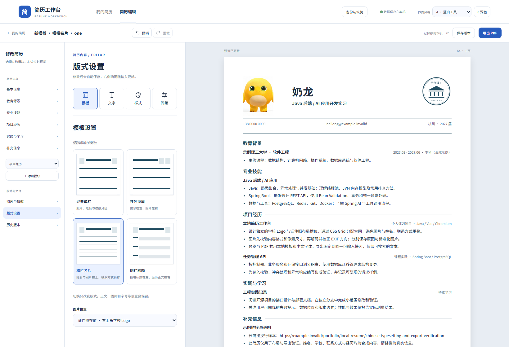
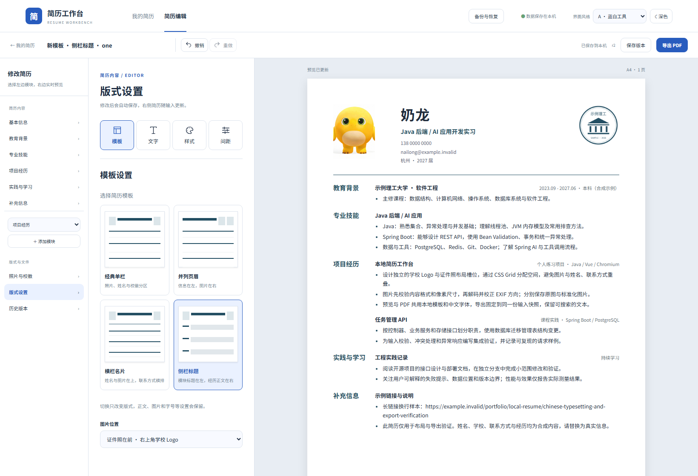

# 四模板验收

2026-09-29，Windows / JDK 21 / Node 24 / Docker Desktop，使用独立 `resume-templates-source` / `resume-templates-target` 和两个旧版升级实例。测试使用合成奶龙简历，未操作实际用户工作区。

## 新版式

- 横栏名片：照片、姓名和学校 Logo 位于上排，联系方式使用下一行的全宽横排，长联系方式允许换行。
- 侧栏标题：模块标题占左侧 22 mm，正文占右侧剩余空间；标题与正文仍按原顺序保留在 DOM 中，共用分页脚本。
- 切换只修改 `layout.template`。正文、图片 UUID、字体、字号、颜色、对齐和间距保持不变；模板选择进入自动保存、撤销、版本对比、复制和完整备份。

## 实际检查

- 9 项前端逻辑测试、37 项 Java 测试通过；旧 schema 2 默认值补齐、schema 3 已有设置保留，四个模板标识允许，任意 CSS 类标识拒绝。
- 18 项浏览器流程完整通过，包括原有编辑 / 保存 / 冲突 / 备份、两套原模板，以及新模板正文保持、图片独立、版本对比 / 恢复、撤销 / 重做、重开和列表名称。
- 两个新模板各有一页、两页 PDF；最大全局字号 12 pt、行距 2、三方向 32 mm 页边距、30 个长条目分别导出 7 页与 8 页，每个条目出现一次。
- 新模板六份 PDF、21 页已用 Poppler 渲染检查；A4、照片 / 校徽、本地 TrueType、中文字符和标题阅读顺序通过。侧栏长标题可能正常换行，检查只移除排版空白，不做 Unicode 字形归一化。
- PDF / 预览共用 CSS 和分页测量；校徽与证件照交换、分别隐藏，页脚安全区和段落完整性均通过浏览器几何检查。
- 完整备份界面测试包含侧栏标题，恢复为新记录后仍可编辑、导出；跨实例恢复核对结构与图片 / PDF 校验值。
- schema 3 旧版在保留数据库 / 文件卷升级后，原正文、样式、修订、日期、图片、历史和既有 PDF 保留；旧备份可导入，旧应用拒绝 schema 4 备份。

## 格式兼容

新模板标识采用 schema 4。读取 schema 2/3 只在内存转换，数据库结构不变、不批量改写旧记录；保存修改后才写入新格式。备份 manifest 明确记录 schema 4，旧应用在导入前拒绝，避免丢失新模板。

当前版接受 schema 2 / 3 / 4 备份。升级应先创建完整备份，保留原 .env 密码和两个数据卷。保存新模板后不承诺原数据库直接回退旧程序；需要旧版本时，在独立实例恢复升级前备份。

## 重复验证

执行 `npm --prefix frontend run test:e2e` 后，用 `scripts/verify-template-pdfs.py` 提取和渲染新模板 PDF。既有 `verify-pdfs.py --stage-c` / `verify-layout-pdfs.py` 保留原模板与样式回归检查。报告和全部页面 PNG 位于被 Git 忽略的 `output/`。

CI 在断开应用外网的容器中执行全部 18 项流程、跨实例恢复和 PDF 检查，另外分别验证公开 schema 2 候选版和 v0.2.0 的保留卷升级；远端结果以对应运行记录为准。
